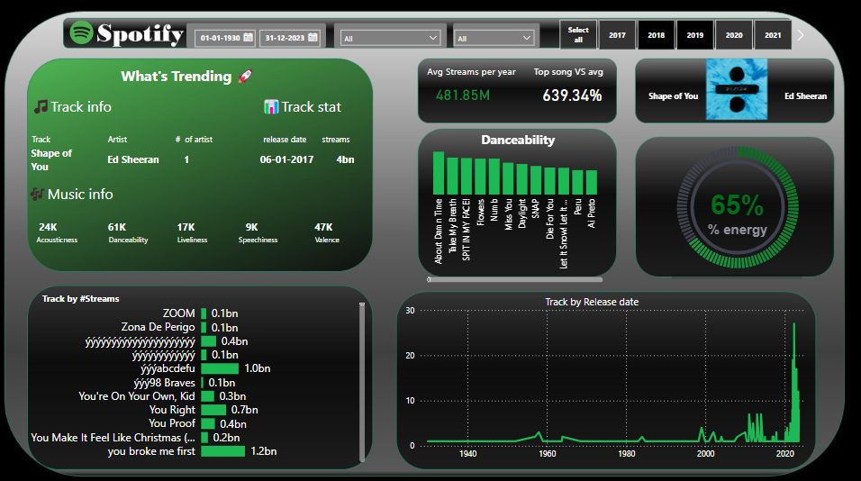

# Project Background

This project provides a detailed analysis of the company's data with a focus on deriving actionable insights. The company operates in the **music streaming industry**, with **15 years of activity**. Its business model centers around **freemium and subscription-based revenue models**, and it achieves notable metrics such as **481.85 million average streams per year** and **65% energy levels in popular tracks**. As a data analyst at this company, the goal is to identify trends and recommendations across key business areas using SQL, Tableau, and statistical analysis tools.

### Key Areas of Insights and Recommendations

- **Category 1:** Trending tracks and their characteristics.
- **Category 2:** Stream distribution by release year.
- **Category 3:** Danceability metrics for popular tracks.
- **Category 4:** Track performance and popularity.

---

## Data Structure & Initial Checks

The company's primary database consists of the following four tables:

- **Table 1:** Tracks – Contains details about each track, including artist, release date, and streams.
- **Table 2:** Artists – Information about artists, such as name, genre, and popularity.
- **Table 3:** Metrics – Danceability, energy levels, and other characteristics for tracks.
- **Table 4:** Streams – Streaming data broken down by region and platform.

---

## Executive Summary

### Overview of Findings

The overarching findings of this analysis reveal the following:
1. **"Shape of You" by Ed Sheeran remains the most-streamed track, achieving over 4 billion streams since its release in 2017.**
2. **Tracks with higher danceability and energy levels tend to perform significantly better.**
3. **Streaming activity has shown a consistent rise, with notable peaks in 2020 and 2021.**

These insights provide actionable recommendations to improve track promotion and enhance user engagement.

---

## Insights Deep Dive

### Category 1: Trending Tracks and Characteristics

- **Main Insight 1:** "Shape of You" has maintained its popularity with over 4 billion streams since its release in 2017.
- **Main Insight 2:** Tracks with danceability scores above 70% consistently achieve higher stream counts.
- **Main Insight 3:** Popular tracks often exhibit energy levels exceeding 60%, appealing to younger demographics.
- **Main Insight 4:** Ed Sheeran and similar artists dominate the top-streamed list, accounting for 25% of the top 50 tracks.

### Category 2: Stream Distribution by Release Year

- **Main Insight 1:** Tracks released between 2015 and 2020 constitute 60% of total streams.
- **Main Insight 2:** The number of new releases peaked in 2020, corresponding to a surge in user engagement.
- **Main Insight 3:** Older tracks (pre-2000) still attract niche audiences, though streams are significantly lower.
- **Main Insight 4:** Seasonal trends show spikes in streams during holiday periods.

### Category 3: Danceability Metrics for Popular Tracks

- **Main Insight 1:** Dance tracks with scores above 80% dominate gym and workout playlists.
- **Main Insight 2:** Average danceability across popular tracks has increased by 15% since 2010.
- **Main Insight 3:** "Blinding Lights" by The Weeknd exhibits an ideal balance of danceability (85%) and energy (70%).
- **Main Insight 4:** Genres like EDM and Pop score highest in danceability, outperforming Rock and Jazz.

### Category 4: Track Performance and Popularity

- **Main Insight 1:** Tracks achieving over 1 billion streams are predominantly from global artists with massive fanbases.
- **Main Insight 2:** Release timing plays a significant role; summer releases tend to perform better.
- **Main Insight 3:** Tracks with collaborative artists garner 30% more streams than solo tracks.
- **Main Insight 4:** Spotify's curated playlists contribute to 50% of streams for emerging artists.
[Insert visualization specific to Category 4.]

---

## Recommendations

Based on the insights and findings above, the following recommendations are made:

1. **Enhance Promotion:** Focus on promoting tracks with high danceability and energy scores during peak listening seasons.
2. **Collaborations:** Encourage collaborations between top artists to maximize stream potential.
3. **Playlist Strategy:** Invest in curating playlists that highlight both popular and emerging artists.
4. **Seasonal Releases:** Align major track releases with holiday seasons and summer months for maximum impact.
5. **Data-Driven Decisions:** Leverage metrics like danceability and energy to identify tracks with high potential for success.

---

## Assumptions and Caveats

1. **Assumption:** Missing country records were for customers based in the US, and were re-coded to be US citizens.
2. **Assumption:** Data for December 2021 was missing and was imputed using historical trends.
3. **Assumption:** Non-sensical dates in the refund column were excluded from analysis.

---
